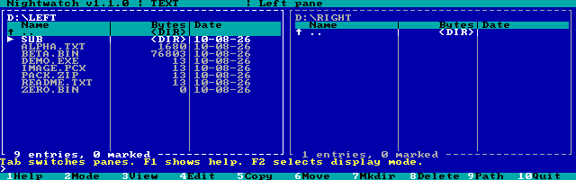
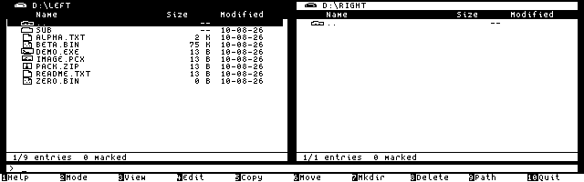
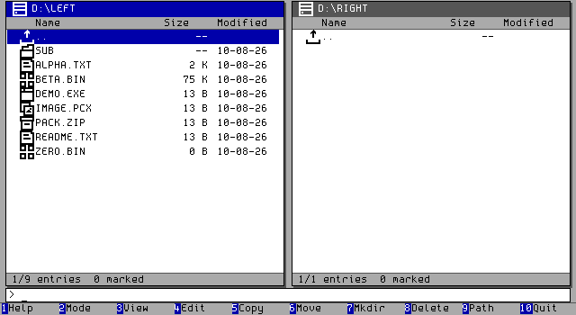
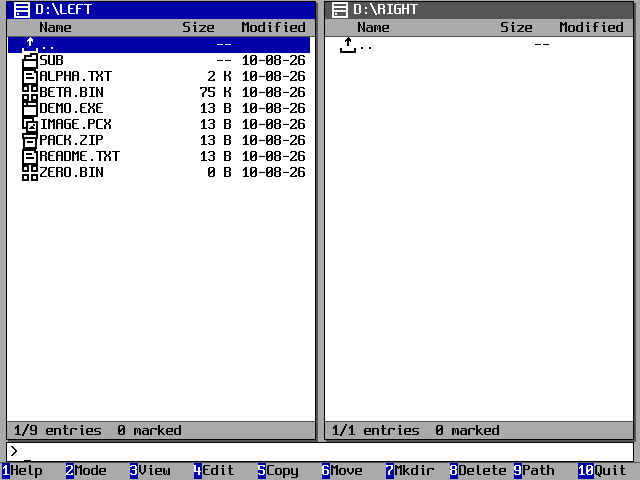
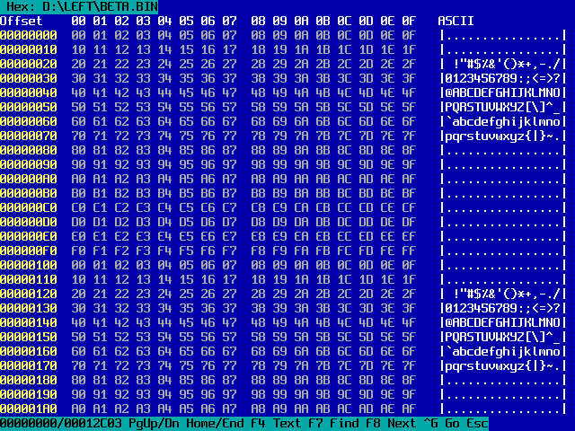
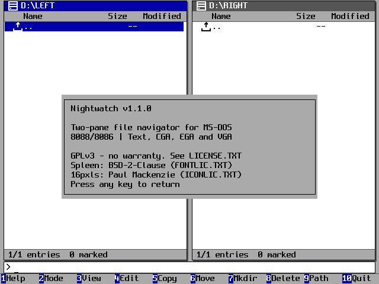
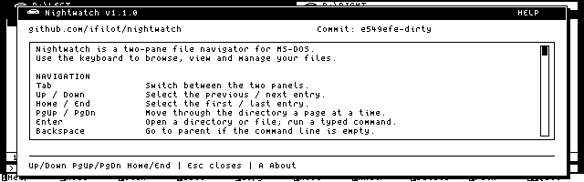
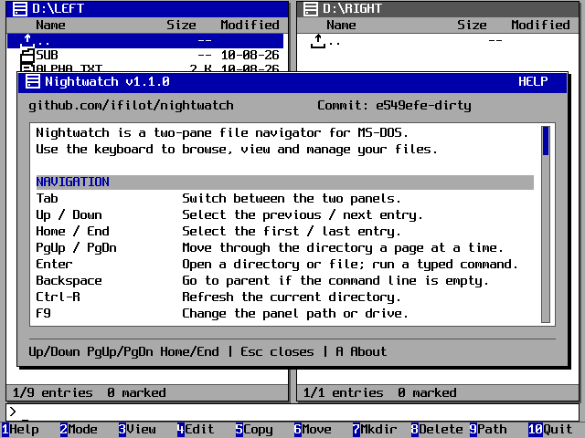
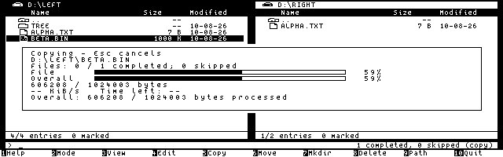
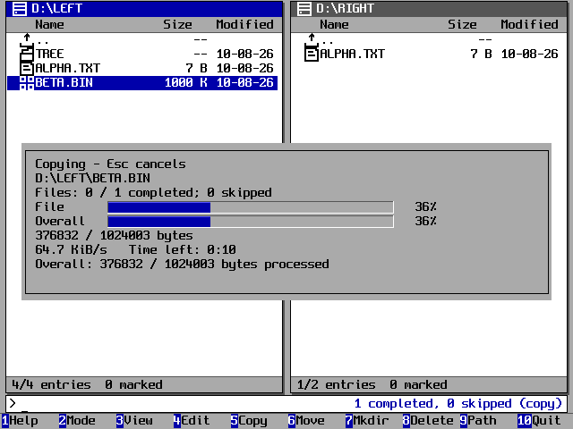

# Nightwatch

[](https://github.com/ifilot/nightwatch/actions/workflows/build.yml)
[](VERSION)
[](LICENSE)

A Midnight Commander style, two-pane file navigator for **MS-DOS on 8088/8086
PCs**, including the IBM 5150. One standalone executable supports text, CGA,
EGA and VGA, with embedded fonts and icons.

| Text · 80×25 | CGA monochrome · 640×200 |
| --- | --- |
|  |  |
| **EGA · 640×350, 16 colors** | **VGA · 640×480, 16 colors** |
|  |  |

Browse drives and directories, mark files with patterns, sort entries, and
recursively copy, move or delete. Transfers offer overwrite/skip and Escape cancellation. Copies count files
recursively before starting and show file/overall progress bars, transfer speed
and estimated time remaining for the current file. Built-in text and hex viewers support search and byte-offset
jumps; an external editor and DOS shell are also available.

<details>
<summary>Built-in hex viewer</summary>



</details>

<details>
<summary>About Nightwatch</summary>



</details>

<details>
<summary>Keyboard help with version and build details</summary>

| CGA | VGA |
| --- | --- |
|  |  |

</details>

<details>
<summary>Copy progress</summary>

| CGA | VGA |
| --- | --- |
|  |  |

</details>

## Run

Download the DOS package from this repository's **Releases** page. Extract it and
keep `LICENSE.TXT`, `FONTLIC.TXT` and `ICONLIC.TXT` alongside `NIGHT.EXE`.

```dos
NIGHT /vga C:\FILES D:\BACKUP
```

Use `/text`, `/cga`, `/ega` or `/vga`; switch during use with **F2**, then **T/C/E/V**.
**Alt-F1** opens About (also **F1**, then **A**).
**Ctrl-W** saves the mode, pane paths and sorting for the next launch.

| Keys | Action |
| --- | --- |
| Tab, arrows, PgUp/PgDn, Enter, Backspace | Switch panes, select, enter, go back |
| Insert / Space, + / - | Mark an entry, mark all / clear marks |
| F3 / Shift-F3 | Text / hex viewer; F4 toggles inside the viewer |
| F4, F5, F6, F7, F8 | Editor, copy, move, mkdir, delete |
| Ctrl-F, Ctrl-P / Ctrl-N, Ctrl-S | Find filename, mark / unmark patterns, sort |
| F9, Ctrl-R, Ctrl-O | Change drive/path, refresh, DOS shell |
| F1, F10 | Help, quit |

Inside either viewer: **F7** searches, **F8** finds the next match, and **Ctrl-G**
jumps to an offset. Search accepts ASCII or bytes such as `hex:DE AD 00 BE EF`.

Requires DOS 3.0+, DOS 8.3 filenames and about **128 KB free conventional RAM**.
EGA needs at least 128 KB video RAM. Each pane caches 512 entries; recursive
operations traverse beyond that cache, up to 32 directory levels. Keyboard only;
archive support is outside the current scope.

## Build and test

The complete DOS toolchain and a Debian Trixie Docker build recipe live in
[`buildenv/`](buildenv/README.md). The image installs DOSBox and DOSBox-X from
Debian's binary packages. Build from this checkout with Docker:

```sh
docker build -t nightwatch-build buildenv
docker run --rm --user "$(id -u):$(id -g)" \
  --volume "$PWD:/workspace" nightwatch-build make build
```

For native Linux builds, install GNU Make, Bash, a C compiler, Python 3 with
Pillow, DOSBox, DOSBox-X and mtools. The default compiler directory is `buildenv/`;
no sibling repository is needed.

```sh
make                                    # build/NIGHT.EXE
make run MODE=vga                        # open a DOSBox window
make test                               # host regression tests + sanitizers
make test-dos                           # DOS filesystem tests on FAT12
make test-video                         # all display modes + BIOS/8086 checks
make screenshots                        # test and refresh README captures
make benchmark-copy                     # compare copy buffer sizes on 8086
make package                            # build/dist/ release files
```

The included Borland tools retain their original proprietary notices; see
[build environment provenance](buildenv/BORLAND-NOTICE.md). Bundled DOSBox-X
sources retain their GPLv2 and component notices.
Nightwatch code and original CGA icons are **GPLv3** ([license](LICENSE)).
VGA/EGA icons use [16pxls](https://16pxls.com/) by Paul Mackenzie under
CC-BY-SA-4.0 ([attribution and license](assets/ICON-LICENSE.txt)). Fonts use
[Spleen](https://github.com/fcambus/spleen) under its BSD license. See the
[manual](docs/manual.md), [rendering notes](docs/rendering.md) and
[asset credits](assets/README.md) for more detail. Release history is recorded in
the [changelog](CHANGELOG.md).
The [source comment style](docs/commenting.md) describes the C89/TASM conventions.

## Continuous integration and releases

Every branch/tag push and pull request runs host regression tests. Branch/tag
pushes also build and test the DOS program in the repository's Docker environment.
Tag pushes publish the validated `NIGHT.EXE`, GPL/font/icon licenses, version
information, DOS ZIP package and checksums as a GitHub release. The executable
includes all four display modes.

All jobs use GitHub-hosted Ubuntu runners. DOS CI builds its environment from
`buildenv/`; it requires no self-hosted runner, compiler secret, Actions variable
or separate source repository. See [CI setup](docs/ci.md).

To bump the version, run `python3 tools/version.py --set v1.0.1`, commit the
updated version/header/badge, then push the matching tag.
